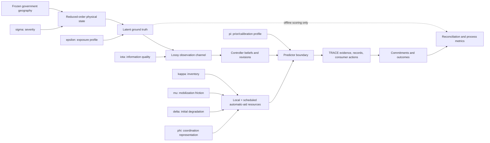

# WF-DFLD-01-SMALL frozen methodology

## Status and supported claim

WF-DFLD-01-SMALL is a deterministic, runnable teaching simulator for testing
TRACE accountability under incomplete flood-response evidence. It establishes
that typed predictor evidence can be gated, revised, committed, persisted, and
replayed. It does **not** establish flood-forecast accuracy, learned-predictor
effectiveness, field generalization, operational readiness, demographic
representativeness, or response safety.

The Small scenario is Task 2 of Dr. Chang's August specification. Task 3
mechanisms—breaches, cascades, mutual aid, crew rotation, federation, the full
crossing network, and casualty modeling—are deliberately absent.

## Frozen contract

| Item | Frozen definition |
|---|---|
| Scenario | `WF-DFLD-01-SMALL` |
| Generator | `delta-small-generator-v6` (`v5` random namespace retained) |
| Book seed | `20260803`, descriptive walkthrough only |
| Time | 2026-01-15 12:00–18:00 PST (20:00–02:00 UTC) |
| Resolution | five-minute physical ticks; 15-minute demand/capacity grid |
| Extent | Andrus, Brannan, Isleton, XNG-03, XNG-04 |
| Cohort | 60 deterministic synthetic people; no real identities or addresses |
| Gauges | RVB threshold-operative; MRU and FPT observational only |
| Expected reports | 40 total; hourly expectations `[3, 5, 7, 12, 8, 5]` |
| Default predictor | transparent Toy teaching fixture |
| Resources | local engine/boat plus fixed preauthorized Rio Vista engine/boat at T+5,400 s |
| Scope exclusions | breach, cascade, mutual-aid negotiation/tiers, rotation, federation, casualty model, new UI |

Expected intensities are process expectations, not forced realization counts.
The amended book seed realizes 45 calls, 13 allocations, 22 refusals, 10
controller-visible repairs, a peak gross compatible load of 1.5, and a peak
finite residual operational pressure of 3.0. Eleven windows have positive
residual demand and zero free compatible capacity. These are descriptive
results, not confirmatory evidence.

## Causal architecture



Every stochastic stage derives its stream from the root seed, scenario identity,
frozen random-namespace version, extent, and stage name. Axis values do not
reseed draws. Generator v6 explicitly retains the v5 random namespace because
the amendment changes resources and metrics only. This common-random-number
design permits mechanism comparisons without silently changing the underlying
random realization.

The required isolation is:

- `sigma` changes physical hazard and may causally change truth.
- `kappa`, `mu`, and `delta` change resources, never hazard or truth.
- `iota` changes observations only.
- `epsilon` changes placement/vulnerability, not hazard.
- `phi` changes coordination representation, not physical inventory.
- `pi` selects a prior/calibration profile within a predictor; it never selects
  Toy versus MLP versus V-JEPA.

## Truth, observations, and leakage boundary

Truth is generated before reports. It contains structures, people, change-point
person trajectories, time-varying access/flood state, levee condition, crossing
state, and latent incidents. Structures are sampled with minimum separation from
the geometric intersection of Isleton and the Sacramento County Andrus footprint,
plus a separate Brannan footprint. No parcel or residential-address data are used.

The observation channel implements zero/one/many reports per incident:
non-reporting, first reports, duplicates, multi-channel reports, revisions,
callback failures, dropped calls, third-party welfare checks, false benign levee
reports, and imprecise multi-method locations. Expected hourly arrivals are
calibrated analytically after truth generation, including expected delay spill
between adjacent hours. The configured call profile never creates truth incidents.

Controller-visible calls contain no incident, person, or structure truth IDs.
Belief repair uses only visible evidence: explicit revision links, shared synthetic
callback tokens, or compatible spatial/temporal/taxonomic similarity. Hidden
lineage is deleted in a test run and public decisions, evidence, TRACE records,
commitments, and outcomes remain byte-identical.

## TRACE execution

Every report becomes a typed plan, action, route observation, resource snapshot,
predictor request, `WorldModelEvidence`, and experimental profile. The complete
`TraceRuntime` path persists evidence, versioned hash-chained TRACE records,
consumer actions, commitments, and outcomes. A commitment is legal only when it
cites the exact record/version whose final consumer action is `CLEAR`.

Allocation uses generated crossing state and route travel time. Resources have
versioned capability sets, activation/transit/staging/travel time, service
duration, availability, and service units. The Type I engine has no
`water_rescue` capability and is never counted or dispatched as a boat. Each
physical resource permits only one concurrent commitment.

At `kappa=0.5`, the frozen profile contains a local Isleton engine and rescue
boat plus one Rio Vista Type I engine and Zodiac rescue boat staged at T+5,400
seconds. City materials document Station 55 at 350 Main Street, Type I engines,
a Zodiac rescue boat, water rescue, and automatic aid to Isleton. The selected
pair and arrival time are teaching assumptions, not claims about current
staffing, real response time, or readiness. No request, negotiation, authority
transfer, mutual-aid tier, or federation event is modeled.

Resource provenance is frozen in
`data/scenario/delta/resources/rio_vista_fire_source_extract_v1.json`. Field-level
sources are the City [operations](https://www.riovistacity.com/fire/page/operations),
[fire FAQ](https://www.riovistacity.com/fire/page/fire-department-faqs),
[fire-suppression](https://www.riovistacity.com/fire/page/fire-suppression), and
[2020 study](https://www.riovistacity.com/media/2931) materials. Because the City
server returned HTTP 403 to the reproducibility client, the repository commits a
project-authored factual extract, URL hashes, and the access limitation—not
copies of the upstream pages. The Station 55 coordinate is a secondary address
geocode and is not survey-grade.

Two capacity measures are evaluated on a fixed 15-minute grid:

1. **Gross compatible scenario load** is active truth demand divided by the
   maximum units coverable by all scheduled, mobilized, reachable, compatible
   resources, whether free or committed. It is computed independently of policy
   and predictor behavior and is the headline scenario-difficulty metric.
2. **Residual operational pressure** first removes truth demand covered by an
   active authorized commitment, then divides remaining demand by free,
   reachable, compatible capacity. False-report commitments consume capacity
   but erase no truth demand. This is a controller-dependent diagnostic.

In both measures, a resource is assigned to at most one capability/route bucket.
Surplus capacity and incompatible resources cannot dilute demand. Zero demand
has ratio zero. Positive demand with zero compatible capacity is explicitly
unserviceable and receives no fabricated denominator.

## Predictor decision

August Task 1 requires a common predictor seam, not a new claim of Delta-specific
JEPA accuracy. Toy, MLP, and V-JEPA-backed implementations share one
`ActionPrefixPredictor` contract and provenance schema. The V-JEPA path consumes
content-addressed features from a pinned frozen encoder and a separately versioned
flood head. It rejects unsafe IDs, symlinks, pickle-based loading, missing files,
non-finite features, and hash/version mismatches.

Heavyweight V-JEPA encoding is optional and offline. CI uses only project-owned
deterministic feature/head fixtures. MLP and V-JEPA are `UNQUALIFIED` for Small
high-consequence actions unless an external frozen qualification artifact names
the exact predictor, calibration, hash, and action class. An unqualified
substitution causes TRACE `HOLD`; it does not silently fall back to Toy.

See [PREDICTOR_QUALIFICATION.md](PREDICTOR_QUALIFICATION.md).

## Statistical protocol and adverse findings

The amended seed list was committed in
`configs/scenarios/wf_dfld_01_small_acceptance_v2.yaml` before execution. The
write-once report is
`docs/delta/validation/WF_DFLD_01_SMALL_VALIDATION_V2.json`. The prior protocol,
report, generator v5, and `book_v1` remain immutable adverse audit evidence.

The untouched `confirmatory-v5-primary` study ran all 100 registered seeds:

| Measure | Result |
|---|---:|
| Observed calls, mean (95% CI) | 38.55 (37.00–40.10) |
| Hour-four calls, mean (95% CI) | 11.18 (10.24–12.12) |
| Configured 12/hour within hour-four 95% CI | yes |
| Peak gross load, median (bootstrap 95% CI) | 1.5 (1.333–1.5) |
| Peak gross load, mean and range | 1.536; 1.0–2.0 |
| Peak finite residual pressure, median (bootstrap 95% CI) | 2.25 (2.0–3.0) |
| Allocation / refusal / repair means | 13.69 / 13.70 / 11.16 |
| Gross / residual unserviceable window means | 0.0 / 7.71 |
| TRACE chains verified | 100/100 |
| v5/v6 protected layers byte-identical | all fields, 100/100 seeds |

All frozen v2 numeric and TRACE-chain gates passed. The bootstrap interval is
reported in full; the preregistered gate applies to the median point estimate,
not to containment of its entire interval. These are generator-process results,
not operational-effectiveness evidence.

Generator v5 remains a valid adverse finding: the local-only inventory and old
hybrid accounting produced a book ratio of 3.0 and a confirmatory-v4 median of
3.0. The v2 amendment does not rewrite those files. It resolves the mismatch
between the prose scope and the `kappa=0.5` local-plus-county capacity table, and
separates intrinsic scenario load from controller-dependent spare-capacity
pressure. See `WF_DFLD_01_SMALL_V2_AMENDMENT.md`.

## Reproduction

Install the exact direct dependency lock and package:

```bash
python -m venv .venv
.venv/bin/python -m pip install -r requirements-delta-ci.lock
.venv/bin/python -m pip install -e . --no-deps
```

Run, replay, validate, and publish:

```bash
.venv/bin/trace-jepa-delta-small run --output /tmp/delta-book
.venv/bin/trace-jepa-delta-small replay \
  --reference /tmp/delta-book --output /tmp/delta-replay
.venv/bin/trace-jepa-delta-small validate \
  --output /tmp/WF_DFLD_01_SMALL_VALIDATION_V2.json
.venv/bin/trace-jepa-delta-small publish \
  --reference /tmp/delta-book --output /tmp/delta-figures
```

Runtime and CI make no network requests. Rebuilding the source geography bundle
requires the separately verified DWR DEM archive/raster; ordinary run, replay,
validation, and publication use the committed offline catalog only.

The committed canonical bundles are
`data/scenario/delta/reference/wf_dfld_01_small_book_v1` and
`data/scenario/delta/reference/wf_dfld_01_small_book_v2`. Reproducing v1 exactly
uses the source commit recorded in its manifest. A new `validate` output is an
independent replication of the frozen seed study; the committed v2 report is the
original write-once confirmatory execution.

## Threats to validity

- Hydrology is reduced-order teaching physics, not a calibrated forecast.
- Geography is simulation-grade and unsuitable for navigation, surveying, or
  incident operations.
- The cohort is synthetic and nonrepresentative.
- Report and resource parameters are process-calibrated, not field-estimated.
- The automatic-aid arrival is fixed and omits staffing uncertainty, requests,
  negotiation, shift turnover, and cascading outages.
- Reconciliation metrics depend on synthetic hidden lineage and do not prove
  identity resolution on real calls.
- The Toy run establishes execution-path coverage, not decision quality.
- Learned predictors have no Small effectiveness claim.

Additional source and model limitations are in the geography, hydrology,
observation/capacity, and predictor cards in this directory.
