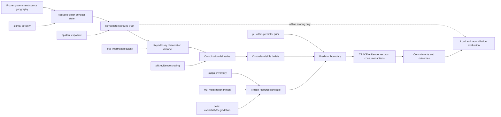

# WF-DFLD-01-SMALL v7 frozen methodology

## Status and supported claim

WF-DFLD-01-SMALL v7 is the runnable Tasks 1 and 2 teaching simulator. Its
scientific mechanics, environment, metrics, and acceptance rules are frozen
before the `confirmatory-v6` seed ensemble is executed. The confirmatory run and
book-v3 publication bundle are intentionally absent until the preregistration
commit is pushed. Rerunning the validator afterward is replication, not the
original execution.

The supported claim is narrow: typed, versioned predictor evidence can be
gated, revised, committed, persisted, evaluated, and replayed through TRACE in a
synthetic flood-response scenario. The project does not claim flood-forecast
accuracy, learned-predictor effectiveness, field generalization, demographic
representativeness, response safety, or operational readiness.

Task 3 mechanisms—breach and cascade physics, negotiated mutual aid, duty
cycles, federation, the full crossing network, casualty modeling, and a new
Delta UI—remain excluded.

## Frozen contract

| Item | V7 definition |
|---|---|
| Scenario schema | `trace-delta-scenario-v3` |
| Generator | `delta-small-generator-v7`; new keyed v7 randomness namespace |
| Truth / observations | `delta-ground-truth-v4` / `delta-observations-v4` |
| Coordination | `delta-coordination-v1` |
| Capacity | `delta-demand-capacity-v3` |
| Acceptance / validation | `delta-small-acceptance-v7` / `delta-validation-v3` |
| Replay | `delta-replay-manifest-v4` plus a separate execution receipt |
| Book seed | `20260803`, descriptive walkthrough only |
| Time | 2026-01-15 12:00–18:00 PST; five-minute physical ticks |
| Extent | Andrus, Brannan, Isleton, XNG-03, XNG-04 |
| Cohort | 60 deterministic synthetic people; no real identities or addresses |
| Gauges | RVB threshold-operative; MRU/FPT observational only |
| Process design | approximately 40 reports; configured 12-report peak hour |
| Predictor | transparent Toy teaching fixture |
| Resources | local engine/boat plus preauthorized Rio Vista engine/boat at T+5,400 s |

Expected report counts are stochastic process-design targets, not forced
realizations or claims about field call distributions.

## Causal architecture and axes



Every stochastic candidate uses a SHA-256-derived semantic key rather than a
mutable iteration stream. Candidate draws therefore remain common across axis
comparisons even when an upstream mechanism changes which candidates realize.

- `sigma` changes physical hazard and may causally change truth.
- `kappa` changes inventory only.
- `mu` changes activation, staging, and travel friction only.
- `iota` changes observations only.
- `epsilon` changes placement, occupancy, and vulnerability, not hazard.
- `phi` changes logical authorities and evidence-delivery latency only.
- `pi` selects a prior/calibration profile within one predictor.
- `delta` changes resource availability/degradation only.

Predictor identity is a separate controlled factor, never a `pi` value.

## Causal truth

Candidate incidents are keyed by `(structure, tick, incident_type)`. A candidate
intensity is the product of a frozen type intercept and local hazard, occupancy,
vulnerability, and access factors. Mechanics are type-specific:

- water rescue requires occupied shallow ponding;
- vehicle rescue requires impaired access plus movement;
- levee inspection follows a newly visible, non-breach levee anomaly and may
  have no associated person;
- medical response requires current occupancy and medical dependency;
- welfare checks emphasize limited mobility or medical dependency;
- missing-person search requires deterministic movement away from home.

Only type intercepts were fitted, using the declared development seeds, to keep
the analytical baseline latent expectation near 26.07 and the existing
synthetic taxonomy design. The coefficients and development diagnostics are in
`data/scenario/delta/calibration/v7_process_coefficients_v1.json`. No evaluated
seed is normalized to a fixed incident total. Severity and exposure are allowed
to change realized truth.

Structures are seeded points inside the reviewed exposure footprint with a
minimum-separation constraint. Person state is represented as deterministic
change-point trajectories. Time-varying structure access/flood state, levee
condition, crossing state, and incident requirements are emitted explicitly.

## Lossy observations and coordination

The independently versioned observation channel maps each truth incident to
zero, one, or many reports and adds independent false reports. It includes
non-reporting, duplicates, multi-channel reports, later revisions, visible
conflicts, callback failures, dropped calls, third-party reports, benign levee
reports, and location noise.

At `iota=0.9`, the frozen location-method mixture is 55% GPS/address
intersection, 27% landmark, and 18% cell sector. Precision ranges are 15–75 m,
200–800 m, and 400–1,500 m respectively. Lower `iota` monotonically shifts mass
toward cell-sector reports and scales ranges by `0.9 / iota`, capped at 3×.
Reporting and hourly coefficients are frozen globally; they are never solved
again for an evaluated seed.

At `phi=1`, one logical authority shares every report immediately. Higher test
values partition reports among source authorities and impose keyed delivery
latency. This is evidence-sharing behavior only: there is no negotiation,
authority transfer, resource mutual aid, or federation.

Public calls contain no truth incident, person, or structure identifier.
Controller clustering uses only explicit revision links, shared synthetic
callback tokens, time, location uncertainty, channel, taxonomy, and visible
description. Deleting hidden lineage leaves decisions, evidence, TRACE records,
commitments, and outcomes byte-identical.

## TRACE execution and resources

Each delivered report becomes a typed plan, grounded action, route belief,
resource snapshot, predictor request, `WorldModelEvidence`, experimental
profile, versioned TRACE record, and consumer action. Durable commitments cite
the exact consumed record/version that authorized them. Outcomes cite the exact
commitment. The append-only record chain and all closure links are verified for
every seed.

Resources declare capabilities, service units, base, route, activation,
transit, staging, travel, service duration, and availability. Generated road and
crossing state controls reachability and travel. Engines have no water-rescue
capability. One physical resource can hold only one concurrent commitment.

The `kappa=0.5` teaching profile contains one local Isleton engine and rescue
boat plus one Rio Vista Type I engine and Zodiac rescue boat staged at T+5,400
seconds. The latter are always labeled **preauthorized automatic aid**, never
local inventory or modeled mutual aid. The selected pair, availability, and
arrival time are scenario assumptions, not claims about real staffing or
response time.

## Load definitions

V7 reports three intrinsic measures on the fixed 15-minute grid:

1. **Strict concurrent load (primary).** Active truth service demand divided by
   the maximum demand covered when each eligible physical resource may serve at
   most one compatible incident and must have enough units to cover it.
2. **Uncapped compatible-service-unit load (sensitivity).** Active demand divided
   by all eligible compatible resource units, counted once per physical
   resource without demand capping.
3. **Registered normalized coverable load index (historical sensitivity).** The
   v6 capability/route-bucket calculation, retained exactly for audit continuity.
   The historical v6 book value of 1.5 belongs to this definition.

No numerical pass band is imposed on the primary strict measure, and the roster
will not be retuned after observing it. Zero demand yields zero. Positive demand
with no compatible capacity is explicitly unserviceable rather than divided by
an invented denominator.

After TRACE execution, strict residual pressure removes only demand covered by
an active, authorized, truth-compatible commitment and matches residual demand
to free strict capacity with the same concurrency semantics. A false-report or
misclassified commitment consumes its resource but erases no truth demand.

## Reconciliation evaluation

Calls sharing one non-null truth incident form a reference cluster; each false
report is its own reference singleton. Controller belief clusters are compared
against the complete reference partition after runtime. V7 reports pairwise
precision, recall, and F1; false-merge, missed-link, and false-report-merge rates;
revision-link precision/recall; occupant-revision correctness; and adjusted Rand
index. Adjusted Rand is implemented directly without a heavy dependency.

The old conditional score appears only in immutable historical reports and is
not described as complete reconciliation accuracy.

## Predictor boundary and qualification

Toy, MLP, and V-JEPA-backed implementations share one `ActionPrefixPredictor`
contract. Every learned qualification must come from a verified frozen artifact
that exactly binds model/calibration hashes, encoder pin when applicable,
feature/action schemas, action classes, evaluation protocol/report hashes,
status, and issuer metadata. Constructor claims alone cannot qualify a learned
model.

V-JEPA features bind an observation digest, encoder version/checkpoint hash,
feature schema and cache digest, and capture time. Loading rejects traversal,
symlinks, nonregular files, stale/future observations, non-finite arrays,
dimension/schema mismatch, and digest mismatch before inference. MLP loading is
pickle-free, separates model and calibration files, validates exact arrays and
schemas, and uses an overflow-safe sigmoid.

Toy has a committed, explicitly non-empirical teaching-fixture qualification.
MLP and V-JEPA remain `UNQUALIFIED` absent an independent matching artifact;
TRACE therefore holds their high-consequence decisions. Heavyweight V-JEPA
encoding is optional offline adapter execution, not effectiveness evidence.

## Geography, environment, and replay

The v3 offline catalog uses government-source anchors and records separate
landing and machine-retrieval URLs, media/schema/license status, exact digests,
CRS transformations, DEM archive/member proof, and safe-refresh rules. Runtime
and CI make no network request. See `GEOGRAPHY_DATA_CARD.md`.

The canonical Delta environment is Python 3.11.14 in the pinned Linux/amd64 OCI
manifest with the complete hash-locked dependency file. General package support
remains Python `>=3.10`; this does not weaken the reference contract.

The replay manifest binds the source-tree hash, environment contract, lock,
expanded configuration, geography/build manifest, parameter/calibration tables,
policy, prior, predictor provenance, and all scientific artifacts. The
source-tree hash covers source code and excludes generated reference/publication
outputs. Actual interpreter, platform, installed distributions, CI run, source
commit, and timestamp live in a separate execution receipt and cannot perturb
scientific byte identity. Validation input is always explicit; ambient files do
not change generation.

## Statistical protocol

The 100 development seeds are the only seeds used for debugging and coefficient
calibration. The untouched holdout is derived exactly from
`SHA-256("WF-DFLD-01-SMALL|confirmatory-v6|index")` with the registered unsigned
31-bit reduction. Its exact 100 seeds, mechanics hashes, environment, and gates
are in `configs/scenarios/wf_dfld_01_small_acceptance_v3.yaml`.

The acceptance file discloses that its midnight timestamp is an inaccurate
administrative placeholder; the first pushed Git commit time is authoritative.
No holdout seed may run before that push.

Inference treats one complete seed as the cluster. Means and fractions use a
deterministic 10,000-resample cluster bootstrap whose randomness derives from
`SHA-256(protocol_hash|metric_name|cluster-bootstrap-v1)`. Medians use an exact
binomial order-statistic interval. Location error is summarized within seed
before the seed-cluster interval. Calls are never pooled as independent samples.

The registered gates cover mean reports, the configured peak within the
peak-hour mean interval, every frozen observation-channel tolerance, book
allocation share, nonzero allocation/refusal/repair behavior, TRACE integrity,
and the 55-second generate/run/replay budget. Strict, uncapped, and historical
load values are reported, but strict load has no numerical gate. Any holdout
failure must be published without tuning or seed replacement.

## Reproduction

```bash
python3.11 -m venv .venv
.venv/bin/python -m pip install --require-hashes -r requirements-delta-python311.lock
.venv/bin/python -m pip install -e . --no-deps

.venv/bin/trace-jepa-delta-small run --output /tmp/delta-v7
.venv/bin/trace-jepa-delta-small replay \
  --reference /tmp/delta-v7 --output /tmp/delta-v7-replay
```

After the original remote confirmatory execution is published, this command is
an independent replication:

```bash
.venv/bin/trace-jepa-delta-small validate \
  --output /tmp/WF_DFLD_01_SMALL_VALIDATION_V3.json
```

Historical `book_v1`, `book_v2`, validation reports, configurations, and figures
remain byte-preserved. Their original definitions and results are protocol
history, not competing v7 confirmatory evidence.

## Threats to validity

- Hydrology is reduced-order teaching physics, not a calibrated forecast.
- Geography is simulation-grade and unsuitable for navigation or operations.
- The cohort is synthetic and nonrepresentative.
- Incident/report coefficients are synthetic process calibration, not field
  estimation.
- Automatic aid omits real staffing, request, negotiation, shift, and outage
  uncertainty.
- Reconciliation uses synthetic lineage and does not establish performance on
  real emergency calls.
- Toy demonstrates execution-path accountability, not decision quality.
- No learned predictor has a Delta effectiveness or qualification claim.
