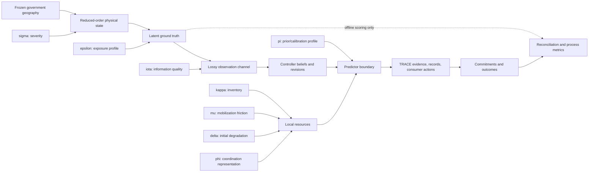

# WF-DFLD-01-SMALL frozen methodology

## Status and supported claim

WF-DFLD-01-SMALL is a deterministic, runnable teaching simulator for testing
TRACE accountability under incomplete flood-response evidence. It establishes
that typed predictor evidence can be gated, revised, committed, persisted, and
replayed. It does **not** establish flood-forecast accuracy, learned-predictor
effectiveness, field generalization, operational readiness, demographic
representativeness, or response safety.

The Small scenario is Task 2 of Dr. Chang's August specification. Task 3
mechanisms—breaches, cascades, mutual aid, crew rotation, federation, the full
crossing network, and casualty modeling—are deliberately absent.

## Frozen contract

| Item | Frozen definition |
|---|---|
| Scenario | `WF-DFLD-01-SMALL` |
| Generator | `delta-small-generator-v5` |
| Book seed | `20260803`, descriptive walkthrough only |
| Time | 2026-01-15 12:00–18:00 PST (20:00–02:00 UTC) |
| Resolution | five-minute physical ticks; 15-minute demand/capacity grid |
| Extent | Andrus, Brannan, Isleton, XNG-03, XNG-04 |
| Cohort | 60 deterministic synthetic people; no real identities or addresses |
| Gauges | RVB threshold-operative; MRU and FPT observational only |
| Expected reports | 40 total; hourly expectations `[3, 5, 7, 12, 8, 5]` |
| Default predictor | transparent Toy teaching fixture |
| Scope exclusions | breach, cascade, mutual aid, rotation, federation, casualty model, new UI |

Expected intensities are process expectations, not forced realization counts.
The book seed currently realizes 45 calls, 7 allocations, 28 refusals, 10
controller-visible repairs, a finite peak ratio of 3.0, and explicit periods of
zero compatible spare capacity. These are descriptive results.

## Causal architecture



Every stochastic stage derives its stream from the root seed, scenario identity,
generator version, extent, and stage name. Axis values do not reseed draws. This
common-random-number design permits mechanism comparisons without silently
changing the underlying random realization.

The required isolation is:

- `sigma` changes physical hazard and may causally change truth.
- `kappa`, `mu`, and `delta` change resources, never hazard or truth.
- `iota` changes observations only.
- `epsilon` changes placement/vulnerability, not hazard.
- `phi` changes coordination representation, not physical inventory.
- `pi` selects a prior/calibration profile within a predictor; it never selects
  Toy versus MLP versus V-JEPA.

## Truth, observations, and leakage boundary

Truth is generated before reports. It contains structures, people, change-point
person trajectories, time-varying access/flood state, levee condition, crossing
state, and latent incidents. Structures are sampled with minimum separation from
the geometric intersection of Isleton and the Sacramento County Andrus footprint,
plus a separate Brannan footprint. No parcel or residential-address data are used.

The observation channel implements zero/one/many reports per incident:
non-reporting, first reports, duplicates, multi-channel reports, revisions,
callback failures, dropped calls, third-party welfare checks, false benign levee
reports, and imprecise multi-method locations. Expected hourly arrivals are
calibrated analytically after truth generation, including expected delay spill
between adjacent hours. The configured call profile never creates truth incidents.

Controller-visible calls contain no incident, person, or structure truth IDs.
Belief repair uses only visible evidence: explicit revision links, shared synthetic
callback tokens, or compatible spatial/temporal/taxonomic similarity. Hidden
lineage is deleted in a test run and public decisions, evidence, TRACE records,
commitments, and outcomes remain byte-identical.

## TRACE execution

Every report becomes a typed plan, action, route observation, resource snapshot,
predictor request, `WorldModelEvidence`, and experimental profile. The complete
`TraceRuntime` path persists evidence, versioned hash-chained TRACE records,
consumer actions, commitments, and outcomes. A commitment is legal only when it
cites the exact record/version whose final consumer action is `CLEAR`.

Allocation uses generated crossing state and route travel time. Resources have
versioned capability sets, activation/staging/travel time, service duration,
availability, and service units. The Type I engine has no `water_rescue`
capability and is never counted or dispatched as a boat.

Demand/capacity is evaluated on a fixed 15-minute grid:

> active unresolved ground-truth service units divided by the maximum units
> coverable by compatible, mobilized, reachable, uncommitted local resources.

A resource is assigned to at most one capability/route bucket. Surplus capacity
and incompatible resources cannot dilute demand. Demand with zero compatible
capacity is reported separately as explicitly unserviceable; no artificial
denominator is inserted.

## Predictor decision

August Task 1 requires a common predictor seam, not a new claim of Delta-specific
JEPA accuracy. Toy, MLP, and V-JEPA-backed implementations share one
`ActionPrefixPredictor` contract and provenance schema. The V-JEPA path consumes
content-addressed features from a pinned frozen encoder and a separately versioned
flood head. It rejects unsafe IDs, symlinks, pickle-based loading, missing files,
non-finite features, and hash/version mismatches.

Heavyweight V-JEPA encoding is optional and offline. CI uses only project-owned
deterministic feature/head fixtures. MLP and V-JEPA are `UNQUALIFIED` for Small
high-consequence actions unless an external frozen qualification artifact names
the exact predictor, calibration, hash, and action class. An unqualified
substitution causes TRACE `HOLD`; it does not silently fall back to Toy.

See [PREDICTOR_QUALIFICATION.md](PREDICTOR_QUALIFICATION.md).

## Statistical protocol and adverse findings

All seed lists are materialized in
`configs/scenarios/wf_dfld_01_small_acceptance.yaml`. The report is
`docs/delta/validation/WF_DFLD_01_SMALL_VALIDATION.json`.

The current untouched `confirmatory-v4-primary` study ran all 100 registered
seeds:

| Measure | Result |
|---|---:|
| Observed calls, mean (95% CI) | 40.39 (38.83–41.95) |
| Hour-four calls, mean | 11.47 |
| Configured 12/hour within hour-four 95% CI | yes |
| Peak finite demand/capacity, median (bootstrap 95% CI) | 3.0 (3.0–3.0) |
| Allocation / refusal / repair means | 8.54 / 19.67 / 12.18 |
| Explicitly unserviceable window mean | 15.02 |
| TRACE chains verified | 100/100 |

The registered 1.4–1.6 median ratio gate therefore failed. This is retained as
an adverse result. The earlier 1.5 result used a pre-audit denominator that could
count surplus or partially incompatible resource units. Restoring that behavior,
or forcing five-minute incident durations that disappear between evaluation
points, would make the number look better while weakening the method; neither is
accepted. Dr. Chang should review whether the scientific definition or the
target regime—not the implementation—should change.

The report retains earlier studies and amendments, including the v1 ratio
failure, the v2 hourly-intensity failure, and the v3 pre-spatial-QA study. These
are generator-process results, not operational effectiveness evidence.

## Reproduction

Install the exact direct dependency lock and package:

```bash
python -m venv .venv
.venv/bin/python -m pip install -r requirements-delta-ci.lock
.venv/bin/python -m pip install -e . --no-deps
```

Run, replay, validate, and publish:

```bash
.venv/bin/trace-jepa-delta-small run --output /tmp/delta-book
.venv/bin/trace-jepa-delta-small replay \
  --reference /tmp/delta-book --output /tmp/delta-replay
.venv/bin/trace-jepa-delta-small validate \
  --output /tmp/WF_DFLD_01_SMALL_VALIDATION.json
.venv/bin/trace-jepa-delta-small publish \
  --reference /tmp/delta-book --output /tmp/delta-figures
```

Runtime and CI make no network requests. Rebuilding the source geography bundle
requires the separately verified DWR DEM archive/raster; ordinary run, replay,
validation, and publication use the committed offline catalog only.

## Threats to validity

- Hydrology is reduced-order teaching physics, not a calibrated forecast.
- Geography is simulation-grade and unsuitable for navigation, surveying, or
  incident operations.
- The cohort is synthetic and nonrepresentative.
- Report and resource parameters are process-calibrated, not field-estimated.
- The resource table omits mutual aid, shift turnover, and cascading outages.
- Reconciliation metrics depend on synthetic hidden lineage and do not prove
  identity resolution on real calls.
- The Toy run establishes execution-path coverage, not decision quality.
- Learned predictors have no Small effectiveness claim.

Additional source and model limitations are in the geography, hydrology,
observation/capacity, and predictor cards in this directory.
