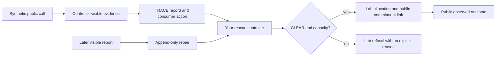

# Build a Small End-to-End Flood-SAR Controller

In this lab you will run the delivered TRACE Small Flood-SAR simulator, follow
one controller-visible decision chain, and finish the rescue controller that
turns a TRACE consumer action plus visible resource state into an allocation,
refusal, or append-only repair.

**Required route:** about 2.5–4 hours. **Optional extensions:** up to 2 more
hours. No GPU, model checkpoint, model training, flood video, live data feed, or
network connection is needed after setup.

## What you will learn

By the end, you should be able to:

1. distinguish latent world state from controller-visible evidence;
2. run and exactly replay `WF-DFLD-01-SMALL`;
3. follow a public call through evidence, TRACE, a controller decision, a
   commitment, and an observed outcome;
4. implement deterministic resource filtering, dispatch, refusal, and repair;
5. explain why TRACE `CLEAR` is necessary but not sufficient for allocation;
6. preserve prior decisions when later visible evidence repairs the belief; and
7. state what this synthetic teaching exercise does—and does not—show.

Debate and regret are separate workshop components. This lab does not claim to
implement either one.

## The scientific boundary

`WF-DFLD-01-SMALL` is a deterministic, headless, synthetic Flood-SAR teaching
simulator. It uses reduced-order hydrology and offline simulation-grade
geography curated from government sources. Its default predictor is a
transparent Toy teaching fixture. It is not an operational emergency-response
system, an empirical model of real people or casualties, or evidence that a
learned predictor is effective.

The book seed `20260803` is a descriptive walkthrough, not a seed selected to
show a favorable result. The retained registered evidence is a separately
authorized deterministic **artifact-reconstruction replication** after the
original and recovery executions failed to retain their artifacts. Do not call
it untouched confirmation.

This lab reads only artifacts that the committed manifest marks
`contains_hidden_truth=false`. It never opens latent incident truth or hidden
call-lineage files. Teaching variants run in the lab directory and are not
registered experiments or research results.

## Architecture



Text alternative: a synthetic public call produces controller-visible
evidence. TRACE records an argument and a consumer action. Your controller then
checks both authorization and visible capacity. It allocates only when both
permit it; otherwise it records a refusal. A later visible report appends a
repair without deleting the earlier decision or creating a duplicate
commitment.

Two decisions must remain separate:

- A TRACE **verdict** describes the argument, such as `accept` or `defer`.
- A TRACE **consumer action** controls use, such as `clear` or `hold`.
- The downstream rescue controller still needs compatible, mobilized,
  reachable, uncommitted capacity before it can make an **allocation**.

## Before class

You need a repository checkout at the instructor-provided revision, macOS or
Linux, and Python 3.11. Python 3.11 is the workshop default and the exact
reference contract uses Python 3.11.14 on Linux/amd64. Python 3.10 and 3.12 are
tested local contingencies, but they are not the canonical book environment.

Native Windows is not a tested workshop path. Use an instructor-prepared Linux
environment or WSL prepared before class rather than attempting a live platform
migration.

From the repository root, create the environment in this order:

```bash
python3.11 -m venv .venv
.venv/bin/python -m pip install --require-hashes -r requirements-delta-python311.lock
.venv/bin/python -m pip install -e . --no-deps
```

Initial setup can use the network to obtain the hash-locked packages and the
isolated build tooling used by the editable-install step. Scenario execution
itself is offline. Installing only the editable package is not enough: the
Small CLI imports the geospatial dependencies included in the lock file. If the
classroom will have no network, the instructor must complete all three setup
commands on the provisioned environment before class.

If Python 3.11 is unavailable and your instructor approved the contingency,
replace `python3.11` in the first command with `python3.12`; keep every later
command unchanged.

## Five-minute preflight

Run:

```bash
.venv/bin/python labs/07_small_sar_codelab/scripts/preflight.py
```

Expected ending:

```text
[PASS] public-data: public artifact hashes and four teaching chains verified
[PASS] temporary-output: per-student temporary output is writable
READY: no GPU, model checkpoint, or live data connection is needed.
```

Do not continue if preflight reports a hash mismatch. Ask the instructor for
the recorded checkout rather than editing a manifest or reference artifact.

## Part 1 — Run the delivered Small simulator

Create a private output directory and run one fresh scenario:

```bash
sar_work_root="$(mktemp -d)"
.venv/bin/trace-jepa-delta-small run --output "$sar_work_root/run"
```

The concise summary should report:

```text
allocated=8 refused=12 repaired=8
```

These are controller events, not counts of real rescues or claims of operational
effectiveness. One allocation is a compatible resource commitment. A refusal
can mean either that TRACE held an unsupported action or that TRACE cleared but
compatible capacity was unavailable. A repair means later controller-visible
evidence revised a belief and its dependent decision path without erasing
history.

Replay your fresh run:

```bash
.venv/bin/trace-jepa-delta-small replay \
  --reference "$sar_work_root/run" \
  --output "$sar_work_root/replay"
```

Expected message:

```text
replay is byte-identical
```

## Part 2 — See the four public cases

Before editing anything, run the completed controller walkthrough supplied for
orientation:

```bash
.venv/bin/python labs/07_small_sar_codelab/lab_runtime.py \
  --controller book \
  --case all
```

Expected output:

```text
TRACE Small SAR teaching loop
-----------------------------
allocation: TRACE=clear -> allocation (allocated_compatible_capacity), resource=RES-ENGINE-01
  public observed outcome: completed_within_window
evidence_hold: TRACE=hold -> refusal (trace_not_clear), resource=none
capacity_refusal: TRACE=clear -> refusal (no_compatible_capacity), resource=none
visible_repair: allocation@v2 -> repair@v4 (new commitment=false)
-----------------------------
Scope: public Small artifacts; lab-only controller; registered result untouched.
```

The runtime hash-checks real public artifacts from the committed Small book and
validates selected evidence, TRACE records, and commitments with repository
contracts. The new controller code is lab-specific; it does not modify or
replace the registered simulator.

## Part 3 — Implement the controller

Open:

```text
labs/07_small_sar_codelab/starter/rescue_controller.py
```

There are exactly three TODOs. Work in the starter file; do not edit the
solution, public case manifest, book artifacts, policy, or scenario
configuration.

### TODO 1: filter resources deterministically

Implement `eligible_resources`.

A resource is eligible only when all four conditions hold:

1. it is currently available;
2. its route is reachable;
3. its route matches the request; and
4. it has the required capability.

Sort eligible resources by `(routed_travel_s, resource_id)`. The second key
makes ties deterministic.

Run:

```bash
TRACE_SMALL_SAR_CONTROLLER=starter .venv/bin/python -m pytest -q \
  labs/07_small_sar_codelab/tests/test_controller.py \
  -k eligible_resources
```

### TODO 2: decide allocation or refusal

Implement `decide_rescue`.

Apply the checks in this order:

1. Reject a mismatched call or belief cluster.
2. If the TRACE consumer action is not `CLEAR`, return an evidence refusal.
3. Otherwise call `eligible_resources`.
4. If no resource remains, return a capacity refusal.
5. Otherwise allocate the first deterministic resource.

Construct the supplied immutable `RescueDecision` type and use the provided
`RescueEventType` and `ReasonCode` enums. Do not hard-code case IDs or resource
IDs.

Run:

```bash
TRACE_SMALL_SAR_CONTROLLER=starter .venv/bin/python -m pytest -q \
  labs/07_small_sar_codelab/tests/test_controller.py \
  -k "clear_plus_capacity or hold_refuses or clear_without_capacity or mismatched"
```

### TODO 3: append a visible-evidence repair

Implement `apply_visible_repair`.

Require:

- an existing decision history;
- the same belief cluster and TRACE record chain;
- a strictly later record version; and
- a nonempty controller-visible evidence basis.

Return the old tuple plus one new `REPAIR` event. Do not replace the old
allocation, reuse its resource as a new allocation, or create another
commitment.

Run:

```bash
TRACE_SMALL_SAR_CONTROLLER=starter .venv/bin/python -m pytest -q \
  labs/07_small_sar_codelab/tests/test_controller.py \
  -k repair
```

### Run all focused checks

```bash
TRACE_SMALL_SAR_CONTROLLER=starter .venv/bin/python -m pytest -q \
  labs/07_small_sar_codelab/tests
```

Success is a green test summary with no failures. The exact count can differ
between the student overlay and the instructor package because instructor-only
release checks are deliberately excluded from the overlay.

## Part 4 — Run your end-to-end controller

```bash
.venv/bin/python labs/07_small_sar_codelab/lab_runtime.py \
  --controller starter \
  --case all
```

Your output should match the four-case walkthrough from Part 2. This does not
mean your code recreated the full simulator. The supplied runtime handles
public artifact loading and contract validation; your code owns the downstream
authorization, capacity, allocation/refusal, and repair decisions.

For a machine-readable audit view:

```bash
.venv/bin/python labs/07_small_sar_codelab/lab_runtime.py \
  --controller starter \
  --case allocation \
  --json
```

Notice that the allocation links the exact TRACE record and version to the
public commitment and observed outcome.

## Part 5 — Controlled teaching comparisons

These commands alter a copied, lab-only resource view. They do not change the
canonical policy, book, or registered result.

Remove available capacity from the case that originally allocated:

```bash
.venv/bin/python labs/07_small_sar_codelab/lab_runtime.py \
  --controller starter \
  --case allocation \
  --variant no-capacity
```

Expected decision:

```text
TRACE=clear -> refusal (no_compatible_capacity)
```

Restore one visible resource in the capacity-refusal case:

```bash
.venv/bin/python labs/07_small_sar_codelab/lab_runtime.py \
  --controller starter \
  --case capacity_refusal \
  --variant restore-capacity
```

Expected decision:

```text
TRACE=clear -> allocation (allocated_compatible_capacity)
```

This comparison shows why a TRACE decision and a resource commitment are
different layers. It is not a counterfactual performance estimate and should
not be reported as a new Small result.

## Part 6 — Replay the committed book

Use a new output path in your private work directory:

```bash
.venv/bin/trace-jepa-delta-small replay \
  --reference data/scenario/delta/reference/wf_dfld_01_small_book_v6 \
  --output "$sar_work_root/book-replay" \
  --validation-report docs/delta/validation/WF_DFLD_01_SMALL_VALIDATION_V6.json
```

Expected message:

```text
replay is byte-identical to data/scenario/delta/reference/wf_dfld_01_small_book_v6
```

Exact replay matters because it binds the claims you inspect to named inputs,
code, environment information, policy, evidence, records, commitments, and
outcomes. Replay does not by itself establish operational correctness.

## Reflection questions

1. Why does the `evidence_hold` case refuse even though one compatible resource
   is visible?
2. Why does the `capacity_refusal` case refuse even though TRACE says `clear`?
3. What information does a TRACE audit chain provide that a single allocation
   label does not?
4. What does the chain still not prove about the real world or the correctness
   of the action?
5. Why is the repair appended instead of replacing record version 2?
6. What additional evidence and review would be required before moving from a
   synthetic teaching simulator toward any field-validation study?

## Optional extensions

- Add a test with two equal-travel-time resources and verify the resource ID
  tie-break is stable under reversed input order.
- Add one unreachable resource and explain why high model support cannot make
  it dispatchable.
- Use `--json` to draw the exact record/version → decision → commitment →
  outcome links for the allocation case.
- Explain why `active_at_scenario_censoring` is not the same as completion or
  failure.

Keep extensions inside this lab and label their outputs teaching-only.

## Troubleshooting

| Symptom | Likely cause | Recovery |
|---|---|---|
| `No module named rasterio` | Editable package installed without the full lock | Run the hash-locked dependency command, then reinstall editable with `--no-deps` |
| `TODO 1/2/3` error | The starter function is still incomplete | Implement the named TODO and run its targeted test |
| Public artifact hash mismatch | Wrong checkout or changed book artifact | Stop; restore the instructor-provided checkout—never edit the manifest |
| `refusing to overwrite` | The requested teaching output already exists | Choose a new file in your private temporary directory |
| Replay mismatch | Inputs, code, environment, or output path changed | Save the message and ask the instructor; do not “fix” reference artifacts |
| Python version failure | Interpreter is outside the tested workshop range | Use instructor-provided Python 3.11 or approved 3.12 contingency |

When asking for help, share the preflight line that failed and the first error
message. Do not share personal paths, tokens, or account information.

## Reset and cleanup

Before discarding work, save your edited starter file somewhere outside the
checkout. In a Git checkout, this command shows exactly what would be lost:

```bash
git diff -- labs/07_small_sar_codelab/starter/rescue_controller.py
```

Only after making a backup, reset the starter with:

```bash
git restore --source=HEAD -- labs/07_small_sar_codelab/starter/rescue_controller.py
```

If you received the student overlay without Git history, re-extract a fresh
copy from the instructor. Your scenario outputs are inside the private
`sar_work_root` directory printed by your shell and can be removed after class
according to your instructor's cleanup policy.

## Accessibility

- Every diagram has a text alternative.
- All required information appears as text; color is never the only signal.
- Terminal examples fit within a 100-column window and do not require a mouse.
- The human-readable output and deterministic JSON contain the same decisions.
- Ask the instructor for the README and starter files before class if you use a
  screen reader or need additional time for environment setup.

## Completion checklist

- [ ] Preflight reports five PASS lines and READY.
- [ ] Fresh Small generation and replay complete.
- [ ] All focused tests pass with the starter controller selected.
- [ ] Your four-case output matches the expected walkthrough.
- [ ] You can explain HOLD versus CLEAR-without-capacity.
- [ ] Your repair preserves the old allocation and creates no new commitment.
- [ ] The committed book replay is byte-identical.
- [ ] You can state the synthetic, non-operational, non-experimental boundary.

For the complete methodology and evidence status, read
[`../../docs/delta/WF_DFLD_01_SMALL.md`](../../docs/delta/WF_DFLD_01_SMALL.md).
