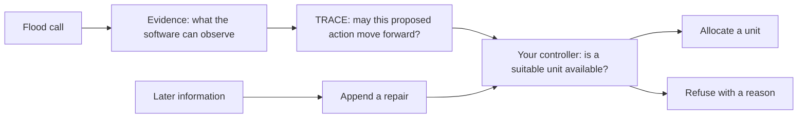

# Flood Rescue Coding Lab: Should We Send a Unit?

Imagine that you are helping a flood-response team.

A call arrives asking for a **welfare check**: someone may need help, and a
response unit might be able to reach them. Before the team sends that unit, the
software must answer two different questions:

1. Is the information good enough to act on?
2. If it is, is a suitable response unit actually available?

In this lab, TRACE—the system's decision notebook—answers the first question.
**Your code answers the second.** You will build the small controller that decides whether to allocate a unit,
refuse the request for a clear reason, or add a later correction without
erasing what happened earlier.

No previous search-and-rescue or TRACE knowledge is expected. The required
route takes about **2.5–4 hours**. Everything happens in a simulation for
learning; it is not a tool for real emergency decisions.

## What you will build

By the end, your controller will handle four examples:

1. **Send a unit:** TRACE says the information may be used, and a suitable unit
   is available.
2. **Wait for better information:** a unit is available, but TRACE says the
   information is not ready for use.
3. **Report no capacity:** TRACE allows the action, but no suitable unit is
   available.
4. **Record a later correction:** new information changes the record, so the
   controller adds a repair while preserving the earlier decision.

You will write three Python functions, test each one, and then run the complete
call-to-decision path.

## Meet the system

**Search and rescue (SAR)** is the work of finding, reaching, and helping people
during an emergency. A response team has limited resources—such as engines,
boats, or medical units—so software must not send a unit merely because a call
exists.

This workshop uses the following path:



Text alternative: a flood call produces evidence. TRACE checks whether that
evidence is good enough for a proposed action. Your controller then checks the
available response units. It either allocates one or refuses with a reason. If
new information arrives later, the system appends a repair instead of deleting
the earlier history.

### The controller sees evidence—not the answer key

Because this is a simulation, the program first creates a complete made-up
story of what is happening. Think of that full story as the simulation's
**hidden answer key**. The controller is not allowed to read it.

Instead, the controller receives **controller-visible evidence**: the partial
information that the simulated calls and observations reveal. TRACE records
what the system currently believes from that visible evidence. This separation
matters because the controller must make its decision from the information it
actually has, not from an answer supplied by the simulation.

### TRACE in plain language

TRACE is the system's **decision notebook**. For each proposed action, it keeps
a versioned record of:

- what the software currently believes;
- which evidence supports that belief; and
- whether another component may use the proposal now.

This lab uses two TRACE decisions:

- **CLEAR:** the proposal passed the required information checks. Your
  controller may now check resources. CLEAR does **not** send a unit.
- **HOLD:** the information is not ready for use—for example, it may be too
  old. Your controller must stop and refuse the request for now.

### Words you will use

| Term | Meaning in this lab |
|---|---|
| **Call** | A request for help, such as a welfare check or medical response |
| **Evidence** | Information the software is allowed to use when making a decision |
| **Controller** | The code that turns TRACE's decision plus resource availability into an action |
| **Resource** | A response unit that has capabilities, a route, and an availability state |
| **Eligible resource** | A unit that is available, can reach the route, and can perform the requested task |
| **Capacity** | At least one eligible resource is free to take the request |
| **Allocation** | The controller selects a resource for the request |
| **Commitment** | The selected resource is reserved for that request |
| **Refusal** | The controller does not allocate a resource and records why |
| **Repair** | A later record corrects the decision history; this is not a physical repair |
| **Record version** | A numbered snapshot of a TRACE record, such as version 2 or version 4 |
| **Replay** | Run the same scenario again and check that it produces exactly the same files |

## What is provided and what belongs to you

The workshop provides the flood simulation, calls, evidence, TRACE records,
resource snapshots, and a small runtime that connects them.

You implement the controller in:

```text
labs/07_small_sar_codelab/starter/rescue_controller.py
```

Your three functions own this part of the path:

```text
TRACE decision + visible resources
                 |
                 v
          your controller
                 |
        +--------+--------+
        |                 |
     allocate           refuse
        |
   later information -> append repair
```

## Workshop map

| Part | What you do | Approximate time |
|---|---|---:|
| 1 | Check your setup | 15 minutes |
| 2 | Run and replay the flood scenario | 20 minutes |
| 3 | Walk through four completed decisions | 20 minutes |
| 4 | Implement and test three functions | 90–120 minutes |
| 5 | Run your completed controller | 15 minutes |
| 6 | Try two “what if?” resource changes | 15 minutes |
| 7 | Replay the saved class example and reflect | 15 minutes |

## Part 1 — Check your setup

Work from the repository root. If your instructor already prepared the Python
environment, skip directly to **Run preflight**.

### Create the environment when needed

```bash
python3.11 -m venv .venv
.venv/bin/python -m pip install --require-hashes -r requirements-delta-python311.lock
.venv/bin/python -m pip install -e . --no-deps
```

If your instructor approved Python 3.12, change only `python3.11` in the first
command. Package installation may use the network; the lab itself does not.

### Run preflight

```bash
.venv/bin/python labs/07_small_sar_codelab/scripts/preflight.py
```

You should see five checks followed by:

```text
[PASS] python: Python 3.11 (preferred workshop version)
[PASS] lab-files: starter code and workshop data found
[PASS] packages: required Python packages are available
[PASS] examples: four rescue examples are ready
[PASS] scratch-space: private practice output is writable
READY: no GPU, model checkpoint, or live data connection is needed.
```

**Checkpoint:** do not continue until you see `READY`. If a check fails, read
the first failure line and use the troubleshooting table near the end.

## Part 2 — Run the flood scenario

A **scenario** is one complete simulated flood-response session. It contains
many calls and controller decisions. Create a private practice directory, then
run the Small scenario:

```bash
sar_work_root="$(mktemp -d)"
.venv/bin/trace-jepa-delta-small run --output "$sar_work_root/run"
```

Near the end, the status line includes:

```text
INFO completed WF-DFLD-01-SMALL: allocated=8 refused=12 repaired=8 ...
```

The command also prints simulator diagnostics after these counts. Your
controller does not use those extra values in this lesson, so focus on the
three event counts:

Read those counts as controller events:

- `allocated=8`: eight requests received a resource commitment;
- `refused=12`: twelve requests did not receive a resource; and
- `repaired=8`: eight decision histories received a later correction.

The counts tell you **what** the controller recorded. In Part 3, you will inspect
**why** individual decisions happened.

### Find the saved decision path

The run saved its readable outputs inside `$sar_work_root/run`. List the six
files that form the path you are studying:

```bash
ls "$sar_work_root/run"/{calls,evidence_ledger,trace_records,controller_decisions,commitments,outcomes}.json
```

Read the filenames from left to right:

```text
call -> visible evidence -> TRACE record -> controller decision -> commitment -> outcome
```

An **evidence ledger** is simply the saved log of evidence entries. You do not
need to open every JSON file now; the four-case walkthrough turns this saved
path into a small, readable example.

### Replay your run

```bash
.venv/bin/trace-jepa-delta-small replay \
  --reference "$sar_work_root/run" \
  --output "$sar_work_root/replay"
```

Expected message:

```text
replay is byte-identical
```

“Byte-identical” means that every saved file matches exactly. This matters
because the same inputs should lead to the same recorded decisions.

## Part 3 — Walk through four rescue decisions

Before you write code, run a completed walkthrough:

```bash
.venv/bin/python labs/07_small_sar_codelab/lab_runtime.py \
  --controller book \
  --case all
```

Here, `book` selects the supplied completed controller, and `all` selects all
four teaching examples. You will switch to your own `starter` controller after
you implement the TODOs.

Expected output:

```text
TRACE Small SAR walkthrough
===========================
1. Welfare check
   TRACE: CLEAR - continue to the resource check
   Controller: ALLOCATE RES-ENGINE-01
   Why: a suitable unit is available and its route is reachable
   Saved outcome: completed within the scenario window

2. Levee inspection
   TRACE: HOLD - stop before checking resources
   Controller: REFUSE
   Why: TRACE did not clear the action

3. Medical response
   TRACE: CLEAR - continue to the resource check
   Controller: REFUSE
   Why: no suitable unit is currently available

4. New information about the welfare check
   History: keep allocation v2, then append repair v4
   New resource commitment: no
===========================
Key idea: CLEAR lets the controller check resources; it does not dispatch one.
```

### Case 1: welfare check → allocate

The call requests a welfare check on route `XNG-04`. TRACE says `CLEAR`, so the
controller is allowed to inspect resources. `RES-ENGINE-01` is available, can
reach the route, and has the `welfare_check` capability. The controller selects
it, and the simulation records that the service completed within its time
window.

### Case 2: levee inspection → refuse because TRACE says HOLD

A **levee** is a barrier built to help hold back floodwater. A suitable unit
exists to inspect one, but the required information is too old. TRACE says
`HOLD`, so the controller refuses before choosing a unit. Resource availability
cannot override an information hold.

### Case 3: medical response → refuse because no unit is available

TRACE says `CLEAR`, but both suitable units are already unavailable. The
controller refuses for lack of capacity. This is the central lesson:

```text
CLEAR means “you may check resources.”
CLEAR does not mean “a resource was sent.”
```

### Case 4: later information → append a repair

The system later receives another report about the welfare-check situation.
The updated TRACE record is version 4. The controller keeps the earlier
allocation at version 2 and appends a repair at version 4. It does not pretend
the earlier decision never happened, and it does not reserve a second unit.

**Checkpoint:** explain the difference between Case 2 and Case 3 to a partner
or instructor before continuing.

## Part 4 — Build the controller

Open:

```text
labs/07_small_sar_codelab/starter/rescue_controller.py
```

There are exactly three TODOs. Complete them in order.

### First, recognize the inputs

The starter uses four small data types from `lab_types.py`:

| Type | What it gives your function |
|---|---|
| `RescueRequest` | The call, requested task, required capability, and route |
| `TraceAuthorization` | TRACE's `CLEAR` or `HOLD` decision and record version |
| `ResourceView` | What your controller can currently see about one response unit |
| `RescueDecision` | The allocation, refusal, or repair your function returns |

In the name `TraceAuthorization`, “authorization” means permission to continue
to the resource check. It does not mean that a unit has been dispatched.

Two identifiers protect the decision chain:

- `call_id` identifies one call.
- `belief_cluster_id` groups calls that the system believes describe the same
  situation. A later update may have a new call ID while remaining in the same
  situation group.

You do not need to create these objects. The workshop runtime supplies them.

### TODO 1 — Which resources are eligible?

Implement `eligible_resources`.

For the welfare-check case, the controller sees:

| Resource | Available? | Route reachable? | Correct route? | Has capability? | Keep? |
|---|---:|---:|---:|---:|---:|
| `RES-ENGINE-01` | yes | yes | yes | yes | **yes** |
| `RES-RV-ENGINE-55-01` | no | yes | yes | yes | no |

Your function must keep a resource only when all four checks pass:

1. `currently_available` is true;
2. `route_reachable` is true;
3. `route_id` matches the request; and
4. `required_capability` appears in the resource's capabilities.

Sort the remaining resources by:

```text
(routed_travel_s, resource_id)
```

`routed_travel_s` is estimated travel time along the route, in seconds. The
resource ID breaks a tie, so the same input always produces the same order.
That repeatable behavior is what **deterministic** means here.

Run the first test:

```bash
TRACE_SMALL_SAR_CONTROLLER=starter .venv/bin/python -m pytest -q \
  labs/07_small_sar_codelab/tests/test_controller.py \
  -k eligible_resources
```

Passing means your filter rejects busy, unreachable, wrong-route, and
wrong-capability resources and returns the usable units in a stable order.

### TODO 2 — Should the controller allocate or refuse?

Implement `decide_rescue` using this decision table:

| TRACE decision | Eligible resource exists? | Return |
|---|---:|---|
| `HOLD` or anything other than `CLEAR` | either | evidence refusal |
| `CLEAR` | no | capacity refusal |
| `CLEAR` | yes | allocation of the first eligible resource |

Apply the checks in this order:

1. Confirm that the request and TRACE authorization name the same `call_id` and
   `belief_cluster_id`. This prevents evidence from one situation from being
   used for another.
2. If TRACE is not `CLEAR`, return `REFUSAL` with reason
   `TRACE_NOT_CLEAR`.
3. Call your `eligible_resources` function.
4. If its result is empty, return `REFUSAL` with reason
   `NO_COMPATIBLE_CAPACITY`.
5. Otherwise return `ALLOCATION` with reason
   `ALLOCATED_COMPATIBLE_CAPACITY` and the first resource's ID.

Use the provided `RescueDecision`, `RescueEventType`, and `ReasonCode` types.
Do not hard-code the example call or engine ID.

Run the tests:

```bash
TRACE_SMALL_SAR_CONTROLLER=starter .venv/bin/python -m pytest -q \
  labs/07_small_sar_codelab/tests/test_controller.py \
  -k "clear_plus_capacity or hold_refuses or clear_without_capacity or mismatched"
```

### TODO 3 — How should later information be recorded?

Implement `apply_visible_repair`.

A **repair** is an update to the decision history, not a rescue unit fixing a
physical object. Imagine the history as a timeline:

```text
version 2: allocate RES-ENGINE-01
version 3: new information begins an update
version 4: append a repair
```

Your function receives the existing history and a later TRACE authorization.
Require:

- at least one earlier decision;
- the same `belief_cluster_id` (the same situation);
- the same TRACE `record_id` (the same record chain);
- a larger `record_version`; and
- a nonempty `visible_evidence_basis`, which lists the observable information
  behind the update.

The history is a Python **tuple**: an ordered sequence that this exercise treats
as immutable. Return the old tuple plus one new `REPAIR` event. Do not replace
the allocation, select the resource again, or create another commitment.

Run the repair tests:

```bash
TRACE_SMALL_SAR_CONTROLLER=starter .venv/bin/python -m pytest -q \
  labs/07_small_sar_codelab/tests/test_controller.py \
  -k repair
```

### Run every student check

```bash
TRACE_SMALL_SAR_CONTROLLER=starter .venv/bin/python -m pytest -q \
  labs/07_small_sar_codelab/tests
```

Success is a green test summary with no failures.

## Part 5 — Run your controller end to end

```bash
.venv/bin/python labs/07_small_sar_codelab/lab_runtime.py \
  --controller starter \
  --case all
```

Your output should match the walkthrough from Part 3. The runtime supplies the
calls, TRACE decisions, and resource snapshots; the three functions you wrote
produce the controller decisions.

**Checkpoint:** point to the line in your code that separates each pair:

- `HOLD` versus `CLEAR`;
- no eligible resource versus at least one eligible resource; and
- earlier history versus an appended repair.

## Part 6 — Ask two “what if?” questions

Now change only a copied resource snapshot. TRACE stays the same, so you can
see exactly what resource availability changes.

### What if the welfare-check units are busy?

```bash
.venv/bin/python labs/07_small_sar_codelab/lab_runtime.py \
  --controller starter \
  --case allocation \
  --variant no-capacity
```

TRACE still says `CLEAR`, but the controller now refuses because no suitable
unit is available.

### What if a medical-response unit becomes available?

```bash
.venv/bin/python labs/07_small_sar_codelab/lab_runtime.py \
  --controller starter \
  --case capacity_refusal \
  --variant restore-capacity
```

TRACE still says `CLEAR`, and the controller can now allocate the available
unit.

These two runs answer one important question cleanly: **resource availability
can change the controller's decision even when TRACE does not change.**

## Part 7 — Replay the saved class example

The repository includes one saved example run. Replay it into your private
practice directory:

```bash
.venv/bin/trace-jepa-delta-small replay \
  --reference data/scenario/delta/reference/wf_dfld_01_small_book_v6 \
  --output "$sar_work_root/book-replay" \
  --validation-report docs/delta/validation/WF_DFLD_01_SMALL_VALIDATION_V6.json
```

Expected message:

```text
replay is byte-identical to data/scenario/delta/reference/wf_dfld_01_small_book_v6
```

You have now reproduced both your fresh run and the saved class example.

## What you should now understand

You did not merely write a resource filter. You completed the decision point
between information and action:

```text
call -> evidence -> TRACE decision -> your resource decision -> saved history
```

You should be able to explain:

1. why `CLEAR` allows a resource check but does not guarantee allocation;
2. why a request can be refused for either information or capacity;
3. why deterministic ordering matters when several units are usable; and
4. why later information is appended instead of erasing an earlier decision.

## Reflection questions

1. Why does the levee-inspection case refuse even though a suitable unit is
   visible?
2. Why does the medical-response case refuse even though TRACE says `CLEAR`?
3. If two eligible units have the same travel time, why do we sort by resource
   ID as well?
4. What would be lost if version 4 replaced version 2 instead of appending a
   repair?
5. Which part of the system decides whether information may be used, and which
   part decides whether a resource can be sent?

## Optional extensions

- Add a test with two equal-travel-time resources and confirm the resource-ID
  tie-break works even when you reverse the input order.
- Add an unreachable resource and confirm that the controller rejects it.
- Run one case with `--json` and find its call ID, TRACE record version,
  controller decision, and selected resource.

Keep optional changes inside this lab directory.

## Troubleshooting

| What you see | What it means | What to do |
|---|---|---|
| Preflight says a package is missing | The Python environment is incomplete | Run the three setup commands again or move to an instructor-prepared machine |
| `TODO 1`, `TODO 2`, or `TODO 3` error | That function still contains its starter placeholder | Open the named function and complete it |
| Workshop-data fingerprint mismatch | The checkout is different or a supplied file changed | Stop and ask the instructor for a fresh checkout |
| `refusing to overwrite` | That output name already exists | Use a new private practice directory |
| Replay mismatch | The two runs did not produce the same files | Save the first error line and ask the instructor; do not edit the saved example |
| Python version failure | The interpreter is outside the workshop versions | Use the instructor's Python 3.11 environment or approved contingency |

When asking for help, share the failed preflight line or the first test failure.
You do not need to share your full screen or personal file paths.

## Reset your code

First see what you changed:

```bash
git diff -- labs/07_small_sar_codelab/starter/rescue_controller.py
```

Save any work you want to keep. Then, in a Git checkout, restore the starter:

```bash
git restore --source=HEAD -- labs/07_small_sar_codelab/starter/rescue_controller.py
```

If your instructor gave you a student overlay without Git history, extract a
fresh copy of the overlay instead.

## Accessibility

- The diagram has a complete text alternative.
- Every required result is available as text; color is never the only signal.
- Commands fit within a 100-column terminal and do not require a mouse.
- Ask for the README and starter before class if you use a screen reader or
  need additional setup time.

## Completion checklist

- [ ] I can describe the path from a flood call to a controller decision.
- [ ] Preflight reports five PASS lines and `READY`.
- [ ] I ran the Small scenario and received a byte-identical replay.
- [ ] My three TODO functions pass all student tests.
- [ ] I can explain the two different refusal reasons.
- [ ] My repair preserves the earlier allocation and creates no second
      commitment.
- [ ] I ran both resource “what if?” examples.
- [ ] I replayed the saved class example.
