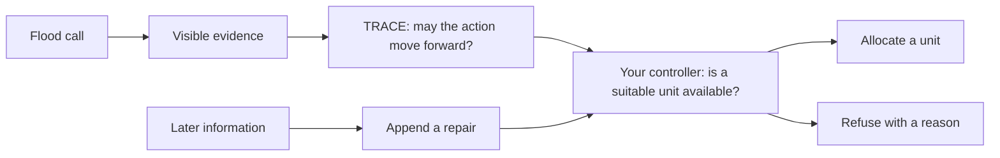

# Flood Rescue Controller Workshop

## Start here

A welfare-check call arrives during a simulated flood. The information may be
ready to use, but should the system actually send a response unit?

That is the decision you will program.

You will build a small controller that can:

1. allocate a suitable response unit;
2. refuse because the information is not ready;
3. refuse because no suitable unit is available; and
4. append a later correction without erasing the earlier decision.

No search-and-rescue or TRACE background is required. The full workshop takes
about **2.5-4 hours**.

> **Edit only:** `exercise/rescue_controller.py`
>
> **Run everything through:** `python workshop.py ...`

## Your workspace

```text
trace-small-sar-workshop/
├── README.md                         follow this lesson from top to bottom
├── setup_workshop.py                 create your local Python environment once
├── workshop.py                       run workshop commands
├── exercise/
│   └── rescue_controller.py          the only file you edit
├── tests/
│   └── test_rescue_controller.py     readable checks for your three TODOs
└── _support/                          supplied teaching data and runtime; do not edit
```

Run this at any time to see the workshop route:

python workshop.py

## Before Step 1 — Set up this laptop

You can complete this workshop on your own laptop. The ZIP already contains
the code and the small public teaching scenario. It does not need an internet connection after you have extracted it.

You need **Python 3.11, 3.12, 3.13, or 3.14**. First, extract the ZIP and open
a terminal *inside* the `trace-small-sar-workshop` folder.

### Extract the folder and open its terminal

Do not run the workshop while the ZIP is still only being previewed. Extract it
first, then open the extracted `trace-small-sar-workshop` folder.

- **Windows:** in File Explorer, choose **Extract All** for the ZIP. Open the
  extracted folder, click its address bar, type `powershell`, and press Enter.
- **macOS:** double-click the ZIP in Finder. Open **Terminal**, type `cd `
  (including the space), drag the extracted workshop folder into the Terminal
  window, then press Return.
- **Linux:** extract the ZIP, open the extracted folder, and use its
  “Open Terminal Here” option when available.

The prompt in your terminal should now be inside the workshop folder. You can
check with `pwd` on macOS/Linux or `cd` on Windows; the final folder name should
be `trace-small-sar-workshop`.

### Check for Python

On macOS or Linux, run:

```bash
python3 --version
```

On Windows, open PowerShell and run:

```powershell
py --version
```

If neither command prints a supported version, install Python from the
[official Python download page](https://www.python.org/downloads/), then close
and reopen your terminal. On Windows, select **Add Python to PATH** if the
installer offers that option.

### Create and activate your workshop environment

A **virtual environment** is a private Python workspace for one project. The
following commands create it locally; they do not download packages.

On macOS or Linux, run:

```bash
python3 setup_workshop.py
source .venv/bin/activate
python workshop.py check
```

On Windows PowerShell, run:

```powershell
py setup_workshop.py
.\.venv\Scripts\Activate.ps1
python workshop.py check
```

If PowerShell blocks the activation command, use **Command Prompt** instead:

```bat
py setup_workshop.py
.venv\Scripts\activate.bat
python workshop.py check
```

You should now see five `PASS` lines and `READY`. Keep this terminal open for
the workshop. If you later close it, open a new terminal in this folder and
repeat only the activation command for your operating system.

Do not run `pip install` or download a model. If setup reports `SETUP STOP`,
share that one line with an instructor. On Ubuntu or Debian, an error that
mentions `venv` may be fixed with `sudo apt install python3-venv` if you have
permission to install software; otherwise, ask the setup helper.

## What system are you building?

**Search and rescue (SAR)** is the work of finding, reaching, and helping people
during an emergency. A response team has limited units, such as engines, boats,
or medical teams, so software must answer two different questions:

1. Is the available information ready to use?
2. If it is, is a suitable response unit actually available?

TRACE, the system's **decision notebook**, answers the first question. **Your
controller answers the second.**



**Text alternative:** a call produces evidence the controller is allowed to
see. TRACE decides whether that information may move forward. Your controller
then checks the response units and either allocates one or refuses with a
reason. Later information can append a repair without deleting the earlier
history.

### Partial evidence

The simulation creates a complete story of what is happening. Think of that
story as a **hidden answer key**. The controller cannot read it.

The controller receives only **visible evidence**: the partial information
revealed by calls and observations. TRACE records what the system currently
believes from that evidence. This makes the exercise realistic in one important
way: the controller must decide from the information it has, not from the
simulation's answer key.

### TRACE decisions in this workshop

- **CLEAR:** the information checks passed. Your controller may continue to
  the resource check. CLEAR does **not** send a unit.
- **HOLD:** the information is not ready to use. Your controller stops before
  choosing a unit.

### Words you will use

| Term | Meaning here |
|---|---|
| **Call** | A request for help, such as a welfare check |
| **Evidence** | Information the controller is allowed to use |
| **Controller** | Your code that combines TRACE's decision with resource availability |
| **Resource** | A response unit with a route, capabilities, and availability state |
| **Eligible resource** | A unit that is available, reachable, on the requested route, and capable of the task |
| **Capacity** | At least one eligible resource is free |
| **Allocation** | Selecting a resource for the request |
| **Commitment** | Reserving the selected resource for that request |
| **Refusal** | Selecting no resource and recording why |
| **Repair** | A later correction to the decision record—not a physical repair |
| **Replay** | Running the same scenario again and checking that every saved file matches |

## Workshop Breakdown

| Step | What you do | Approximate time |
|---:|---|---:|
| 1 | Check your local setup | 5 minutes |
| 2 | Run the bundled small scenario | 15 minutes |
| 3 | Study four completed decisions | 20-25 minutes |
| 4 | Implement and test three functions | 90-120 minutes |
| 5 | Run your completed controller | 15 minutes |
| 6 | Change resource capacity | 15-20 minutes |
| 7 | Replay the saved histories | 15 minutes |

---

## Step 1: Check your setup

**GOAL:** confirm that your local Python environment, workshop files, four
teaching cases, tests, and practice-output directory are ready.

**DO THIS:** open a terminal in this workshop folder and run:

```bash
python workshop.py check
```

**EXPECTED:**

```text
[PASS] python: Python 3.11 is ready
[PASS] workshop-files: guide, setup tool, exercise, tests, and teaching data found
[PASS] teaching-data: four public teaching cases are ready
[PASS] tests: Python's built-in test runner is ready
[PASS] workspace: practice output is writable
READY: continue to Step 2 with 'python workshop.py scenario'.
```

Python 3.12, 3.13, or 3.14 is also supported, so the first line may say one of
those versions.

**READY SIGNAL:** you see five `PASS` lines and `READY`. If you see `STOP`,
share that one line with an instructor rather than changing supplied files.
Most setup issues mean that the virtual environment has not been activated.

---

## Step 2: Run the small flood scenario

Before you write the controller, run the small simulated flood session included
with this workshop. It does not call the three unfinished functions in your
exercise file.

This is an end-to-end example: a call moves through evidence, TRACE, a
completed controller, a resource commitment, and an outcome. In Step 4, you
will implement the controller rules used by these four teaching decisions.

Run the supplied scenario:

```bash
python workshop.py scenario
```

You should see:

```text
Scenario complete: 1 allocated, 2 refused, 1 repaired.
Saved decision path:
  call -> evidence -> TRACE record -> controller decision -> commitment -> outcome
```

Read the counts as recorded controller events:

- `1 allocated`: one request received a resource commitment;
- `2 refused`: two requests received no resource; and
- `1 repaired`: one decision history received a later correction.

The run creates a `.workshop/run` directory. You do not need to browse all of
it. These six safe files form the path you are studying:

```text
calls.json
evidence_ledger.json
trace_records.json
controller_decisions.json
commitments.json
outcomes.json
```

An **evidence ledger** is the saved log of evidence entries. For now, the
important idea is the order of the six files, not their internal JSON details.

---

## Step 3: Study four completed controller decisions

Now zoom in on four representative decisions from the supplied scenario. They
show the three kinds of result a controller can record for a rescue request or
later update: an **allocation**, a **refusal**, or an appended **repair**. Your
three exercise functions will implement the rules that produce these results.

Run the walkthrough:

```bash
python workshop.py walkthrough
```

The command prints the supplied completed decisions in the terminal. Read the
four cases below as you read the matching text output. This lets you see the
target behavior without revealing the exercise solution.

### Case 1: welfare check → allocate

TRACE says `CLEAR`. Engine 01 is available, can reach the route, is assigned to
that route, and can perform a welfare check. The controller allocates it.

```text
TRACE: CLEAR
Controller: ALLOCATE RES-ENGINE-01
```

### Case 2: levee inspection → information refusal

A **levee** is a barrier that helps hold back floodwater. A suitable unit is
available, but the evidence is too old. TRACE says `HOLD`, so the controller
stops before checking resources.

```text
TRACE: HOLD
Controller: REFUSE
Why: TRACE did not clear the action
```

### Case 3: medical response → capacity refusal

TRACE says `CLEAR`, but both suitable units are busy. The controller refuses
because no eligible resource is available.

```text
TRACE: CLEAR
Controller: REFUSE
Why: no suitable unit is currently available
```

This is the central differentiator:

```text
CLEAR means “you may check resources.”
CLEAR does not mean “a resource was sent.”
```

### Case 4: later information → append a repair

Later visible evidence updates the welfare-check record from version 2 to
version 4. The controller keeps the earlier allocation and appends a repair. It
does not reserve a second unit.

```text
History: keep allocation v2, then append repair v4
New resource commitment: no
```

Before coding, notice the key contrast: Case 2 refuses because TRACE has not
cleared the information, while Case 3 reaches the resource check but finds no
eligible unit. Case 4 adds new history instead of replacing version 2.

---

## Step 4: Build and test the controller

**GOAL:** implement the three small decisions that connect TRACE, resource
availability, and later record updates.

Open the only file you will edit:

```text
exercise/rescue_controller.py
```

It contains exactly three TODO functions. You will complete them in order.

### The inputs

| Type | What it gives your function |
|---|---|
| `RescueRequest` | The call, requested task, required capability, and route |
| `TraceAuthorization` | TRACE's `CLEAR` or `HOLD` decision and record version |
| `ResourceView` | What the controller can currently see about one unit |
| `RescueDecision` | The allocation, refusal, or repair your function returns |

In `TraceAuthorization`, “authorization” means permission to continue to the
resource check. It does not mean that a unit was dispatched.

Two identifiers keep information attached to the correct situation:

- `call_id` identifies one call;
- `belief_cluster_id` groups calls believed to describe the same situation.

The workshop supplies these objects. You do not construct them yourself.

### What each function must return

Every TODO has one clear job. The supplied `_decision_from_trace(...)` helper
builds a `RescueDecision` and automatically copies the shared TRACE fields, so
you only need to choose the event, reason, and (when allocating) resource ID.

| Function | For valid input, return | For invalid input, do this |
|---|---|---|
| `eligible_resources` | A sorted `tuple` of `ResourceView` items. Return `()` when no unit is eligible. | No special error case in this exercise. |
| `decide_rescue` | One `RescueDecision`: allocation or refusal. | Raise `ValueError` only when the request and TRACE authorization do not name the same call and situation. |
| `apply_visible_repair` | A new `tuple` containing the original history followed by one repair decision. | Raise `ValueError` when the proposed repair cannot validly extend that history. |

A `HOLD` decision and a lack of capacity are normal controller outcomes. Return
a refusal for either one; do **not** raise `ValueError`. `ValueError` is only
for input records that cannot describe one valid decision or repair chain.

### TODO 1: Which units can help?

Implement `eligible_resources`.

**Return:** one sorted `tuple[ResourceView, ...]`. Return an empty tuple,
`()`, when no resource passes all four checks. Do not change the supplied
`resources` tuple.

Keep a resource only when all four checks pass:

1. it is currently available;
2. its route is reachable;
3. its route matches the request; and
4. it has the required capability.

Sort the remaining resources by:

```text
(routed_travel_s, resource_id)
```

`routed_travel_s` is the estimated route travel time in seconds. The resource
ID breaks a tie. This makes the result **deterministic**: the same inputs always
produce the same order.

Test TODO 1:

```bash
python workshop.py test 1
```

**WHEN IT PASSES:** the command reports one passing test and tells you to start
TODO 2.

### TODO 2: Should the controller send a unit?

Implement `decide_rescue` using this table:

| TRACE decision | Eligible unit? | Controller result |
|---|---:|---|
| anything other than `CLEAR` | either | refusal: `TRACE_NOT_CLEAR`, no selected resource |
| `CLEAR` | no | refusal: `NO_COMPATIBLE_CAPACITY`, no selected resource |
| `CLEAR` | yes | allocation: `ALLOCATED_COMPATIBLE_CAPACITY`, first eligible resource ID |

Apply the checks in this order:

1. confirm that the request and TRACE authorization have the same `call_id`
   and `belief_cluster_id`;
2. refuse with `TRACE_NOT_CLEAR` when TRACE is not `CLEAR`;
3. call your `eligible_resources` function;
4. refuse with `NO_COMPATIBLE_CAPACITY` when the result is empty; or
5. allocate the first result with `ALLOCATED_COMPATIBLE_CAPACITY`.

**Return:** one `RescueDecision` in every normal case. For the two refusal
rows, leave `selected_resource_id` as `None`. For the allocation row, pass the
first eligible resource's `resource_id` to `_decision_from_trace(...)`.

**When to raise an error:** if either `call_id` or `belief_cluster_id` differs,
raise `ValueError` instead of returning an allocation or refusal. Those two
input objects would be describing different situations. The test checks the
exception type, not the exact wording of its message.

Use the imported `RescueDecision`, `RescueEventType`, and `ReasonCode` types.
Do not hard-code the welfare-check call or Engine 01.

Test TODO 2:

```bash
python workshop.py test 2
```

**WHEN IT PASSES:** all five allocation/refusal tests pass.

### TODO 3: How should later information be recorded?

Implement `apply_visible_repair`.

**Return:** a new `tuple[RescueDecision, ...]` with every earlier item left in
place and one new repair at the end. The repair must have event type `REPAIR`,
reason code `VISIBLE_EVIDENCE_REPAIR`, and `selected_resource_id=None`.

Imagine the decision history as a timeline:

```text
version 2: allocate Engine 01
version 3: later information begins an update
version 4: append a repair
```

Require:

- at least one earlier decision;
- the same `belief_cluster_id`;
- the same TRACE `record_id`;
- a larger `record_version`; and
- a nonempty `visible_evidence_basis`—the visible information behind the
  update.

If any requirement in this list fails, raise `ValueError`; do not return a
refusal or a partial history. Each requirement is an input-consistency check,
not a normal rescue outcome.

The history is a Python **tuple**, an ordered sequence this exercise treats as
unchangeable. Return the old tuple plus one new `REPAIR` event. Do not replace
the allocation or select the unit again.

Test TODO 3:

```bash
python workshop.py test 3
```

Six repair tests should pass. Then run all twelve behavior tests:

```bash
python workshop.py test all
```

**WHEN ALL TESTS PASS:** the command tells you to run your
controller.

---

## Step 5: Run your controller

Your three functions are now complete. Connect them to the four teaching cases
and compare their results with the supplied walkthrough from Step 3.

Run:

```bash
python workshop.py run
```

Your output should match the four decisions from Step 3:

- welfare check → allocate Engine 01;
- levee inspection → information refusal;
- medical response → capacity refusal; and
- later welfare-check evidence → append repair version 4.

This confirms that the functions you wrote reproduce the completed examples:
TRACE status separates information refusal from the resource check, capacity
separates allocation from capacity refusal, and the repair remains appended to
the earlier history.

If the run reports that a TODO is unfinished or a case does not match, return
to the first failing test instead of editing the supplied examples.

---

## Step 6: Change capacity

Next, change only resource availability and observe how your controller reacts
while TRACE stays the same.

Run:

```bash
python workshop.py what-if
```

The command asks two questions:

1. What if all welfare-check units become busy?
2. What if a medical-response unit becomes available?

In both examples, TRACE stays `CLEAR`. The first controller result changes from
allocation to capacity refusal. The second changes from capacity refusal to
allocation.

---

## Step 7: Replay the saved histories

Finish by checking deterministic replay: the saved run from Step 2 should be
regenerated exactly.

Run:

```bash
python workshop.py replay
```

You should see:

```text
Replay: byte-identical.
COMPLETE: CLEAR permits a resource check; allocation also requires capacity.
```

“Byte-identical” means every saved file matches exactly. Deterministic replay
makes it possible to inspect the same decision history again.

```text
call -> visible evidence -> TRACE -> resource check -> saved action -> outcome
                                      |
                              later repair is appended
```

## Completion checklist

- [ ] The setup command reports five `PASS` lines and `READY`.
- [ ] All twelve behavior tests pass.
- [ ] My controller produces the four expected decisions.
- [ ] I read the four decisions and my controller's matching decisions.
- [ ] The capacity comparison changes controller results while TRACE stays `CLEAR`.
- [ ] The replay check reports `byte-identical`.

## Troubleshooting

| What you see | What to do |
|---|---|
| `python: command not found` | Activate `.venv` again, then run `python workshop.py check` |
| `SETUP STOP: Python ... is required` | Install a supported Python version, then rerun `setup_workshop.py` |
| `SETUP STOP: .venv already exists` | Use `python3 setup_workshop.py --repair` (or `py ... --repair` on Windows) only if you want to replace that local environment |
| A TODO test fails | Read the first failure, then return to that TODO's decision rule |
| `NotImplementedError: TODO ...` | Complete that named function in `exercise/rescue_controller.py` |
| `run already exists` | Continue to the next step or reset if you intend to restart |
| Replay says to run Step 2 | Run `python workshop.py scenario` first |
| Many import errors | Confirm your terminal is open in the workshop folder and `.venv` is activated |

## Reset practice outputs

To remove generated runs while keeping your controller code:

```bash
python workshop.py reset
```

The command removes only this workspace's hidden `.workshop` directory. It does
not change `exercise/rescue_controller.py`.

To reset your code, replace `exercise/rescue_controller.py` with a fresh copy
from the student package.

## Optional challenges

After the required route is complete, you may:

- add a test with two equal-travel-time units and confirm the resource-ID
  tie-break;
- add an unreachable unit and explain why it is rejected; or
- reverse the input resource order and confirm the selected order is unchanged.

Keep your changes inside `exercise/` and `tests/`.

## Accessibility

- The text below every diagram communicates the same information as the image.
- Every required action is available through a keyboard-run terminal command.
- Commands and expected outputs are presented as selectable text.
- Ask for a paired workflow or additional setup time if either would help.

## Research reuse

If you adapt this workshop or build on TRACE-WorldModel in research, please
cite:

> Edward Y. Chang. **TRW: TRACE-RealWorld---An Auditable Consistency Contract
> for World Models as Materialized Views.** arXiv:2607.21910, 2026.
> <https://arxiv.org/abs/2607.21910>
